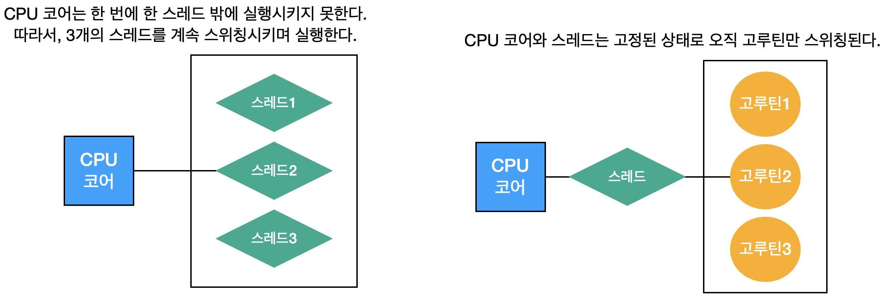

# 고루틴(goroutine)
고루틴은 Go 언어에서 관리하는 경량 스레드이다. 스레드처럼 동시성 프로그래밍에 사용되지만, OS의 스레드를 직접 사용하지 않고, 논리적인 개념으로 이를 구현해서 훨씬 가볍다.

## 1. 스레드
OS가 제공하는 스레드를 멀티로 사용하게 되면 *컨텍스트 스위칭*이라는 고비용이 발생한다. 각 스레드 컨텍스트는 실행 정보를 레지스터(범용, 명령, PC 등)에 저장해둔다. 하나의 코어는 이러한 레지스터 묶음을 하나 밖에 가지고 있지 않기 때문에 스레드별로 이를 계속 스위칭해줘야 한다.

## 2. 고루틴(goroutine)
모든 명령은 OS 스레드를 통해서 CPU 코어에서 실행된다. Go로 만든 프로그램 역시 OS 위에서 돌아가기 때문에 명령을 수행하려면 OS 스레드를 만들어서 명령을 실행해야한다.

<br/>



컨텍스트 스위칭은 CPU 코어가 스레드를 변경할 때 발생하는데 고루틴을 이용하면 코어와 스레드는 변경되지 않고 오직 고루틴만 옮겨 다니기 때문에 컨텍스트 스위칭 비용이 발생하지 않는다.

## 3. 동시성 프로그래밍 주의점
동시성 프로그래밍의 문제점은 동일한 메모리 자원에 여러 고루틴이 접근할 때 발생한다. 즉, 데이터의 입출력이 발생하는 곳(임계영역)에 여러 고루틴이 접근하게되면 기대하지 않은 에러가 발생한다.
```go
type Account struct {
    Balance int
}

func main() {
    var wg sync.WaitGroup
    account := &Account{0}
    wg.Add(10)
    for i := 0; i < 10; i++ {
        go func() {
            for {
                DepositAndWithdraw(account)
            }
            wg.Done()
        }
    }
    wg.Wait()
}

func DepositAndWithdraw(account *Account) {
    if account.Balance < 0 {
        panic(fmt.Sprintf("Balance should not be negative value"))
    }
    account.Balance += 1000
    time.Sleep(time.Millisecond)
    account.Balance -= 1000
}
```

## 4. 뮤텍스와 데드락
### 뮤텍스
위 동시성 프로그래밍의 문제점을 해결하는 가장 단순한 방법은 하나의 메모리 자원에는 하나의 고루틴만 접근할 수 있게끔하는 것이다.
```go
package main

import (
    "fmt"
    "sync"
    "time"
)

var mutex sync.Mutex

type Account struct {
    Balance int
}

func DepositAndWithdraw(account *Account) {
    mutex.Lock()  // 뮤텍스 락을 획득한다.
    defer mutex.Unlock()  // defer를 이용해 실행 마지막에 뮤텍스 락을 해제한다.
    
    if account.Balance < 0 {
        panic(fmt.Sprintf("Balance should not be negative value"))
    }
    account.Balance += 1000
    time.Sleep(time.Millisecond)
    account.Balance -= 1000
}

func main() {
    var wg sync.WaitGroup

    account := &Account{0}
    wg.Add(10)
    for i := 0; i < 10; i++ {
        go func() {
            for {
                DepositAndWithdraw(account)
            }
            wg.Done()
        }()
    }
    wg.Wait()
}
```

#### 데드락
뮤텍스를 사용하면 동시성 프로그래밍 문제를 해결할 수 있지만, 또 다른 문제가 발생할 수 있다.
<ol>
1. 동시성 프로그래밍으로 얻는 성능 향상을 얻을 수 없다. <br/>
2. 데드락이 발생할 수 있다. (뮤텍스의 락으로 인한 문제)
</ol>

여러 고루틴이 있고, 서로가 서로의 Unlock()을 기다리는 상황을 데드락이라 한다. 
